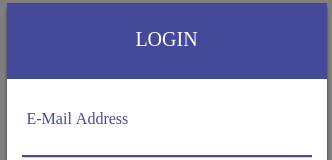
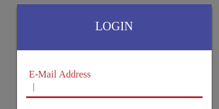
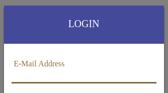
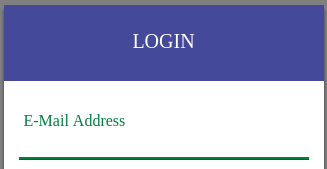
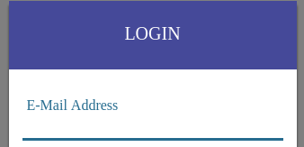

# Floating labels CSS (only)

This Package is build over bootsrtap 3.x 

## Installation
```bash
npm install floating-labels --save
```
## Usage

Add the floating label script in your styles as follow
```scss
@import "~floating-labels";
```

## Examples

All You need now is: 

1. Make sure that the input you need to have a floating label have the `required` attr. 
2. Add the class `group` to the input wrapper like the example below.
3. Add the `<span class="bar"></span>` after the input so it gives you the line effect.
```html
<div class="form-group group">
    <input id="email" type="email" class="form-control" name="email" required />
    <span class="bar"></span>
    <label for="email">E-Mail Address</label>
</div>
```


## Helper Classes
### 1. Error styles
you need to add class `has-error` along with class `group`
```html
<div class="form-group group has-error">
    <input id="email" type="email" class="form-control" name="email" required />
    <span class="bar"></span>
    <label for="email">E-Mail Address</label>
</div>
```


### 2. warning styles
you need to add class `has-warning` along with class `group`
```html
<div class="form-group group has-warning">
    <input id="email" type="email" class="form-control" name="email" required />
    <span class="bar"></span>
    <label for="email">E-Mail Address</label>
</div>
```


### 3. warning styles
you need to add class `has-success` along with class `group`
```html
<div class="form-group group has-success">
    <input id="email" type="email" class="form-control" name="email" required />
    <span class="bar"></span>
    <label for="email">E-Mail Address</label>
</div>
```


### 4. info styles
you need to add class `has-info` along with class `group`
```html
<div class="form-group group has-info">
    <input id="email" type="email" class="form-control" name="email" required />
    <span class="bar"></span>
    <label for="email">E-Mail Address</label>
</div>
```

